# Flujo de la Aplicación — MoneyNeedle

Este documento describe la arquitectura de navegación, los flujos principales de usuario y la distribución de pantallas de la app MoneyNeedle en su versión actual con 4 pestañas y navegación modular.

Todas las capturas fueron tomadas directamente sobre el dispositivo físico (`Redmi Note 13 / 24090RA29G`) ejecutando la versión compilada con motor IA y SQLCipher local.

---

## 1. Arquitectura de Navegación

La aplicación organiza sus funciones en una barra inferior de 4 destinos principales, complementada por un hub de herramientas y pantallas autónomas con su propio `Scaffold`:

```
┌─────────────────────────────────────────────────────────────┐
│                       MoneyNeedle                           │
├──────────────┬──────────────┬──────────────┬────────────────┤
│   Inicio     │ Movimientos  │   Análisis   │      Más       │
│   (Tab 0)    │   (Tab 1)    │   (Tab 2)    │    (Tab 3)     │
└──────┬───────┴──────┬───────┴──────────────┴───────┬────────┘
       │              │                              │
       ▼              ▼                              ▼
  Quick Add NLP   Detalle/Edición            ┌───────┴────────┐
  (Modal Voz/Tx)  de Movimiento              │  Herramientas  │
                                             ├────────────────┤
                                             │ • Cuentas      │
                                             │ • Presupuestos │
                                             │ • Metas        │
                                             │ • Recurrentes  │
                                             │ • Categorías   │
                                             │ • Ajustes      │
                                             │ • Seguridad    │
                                             │ • Respaldos    │
                                             └────────────────┘
```

---

## 2. Onboarding y Acceso Seguro

### Bienvenida Guiada
Al abrir la app por primera vez, se presenta un onboarding en 3 diapositivas que explican el modelo local-first (sin servidores ni nube), el motor de lenguaje natural local y la protección biométrica.

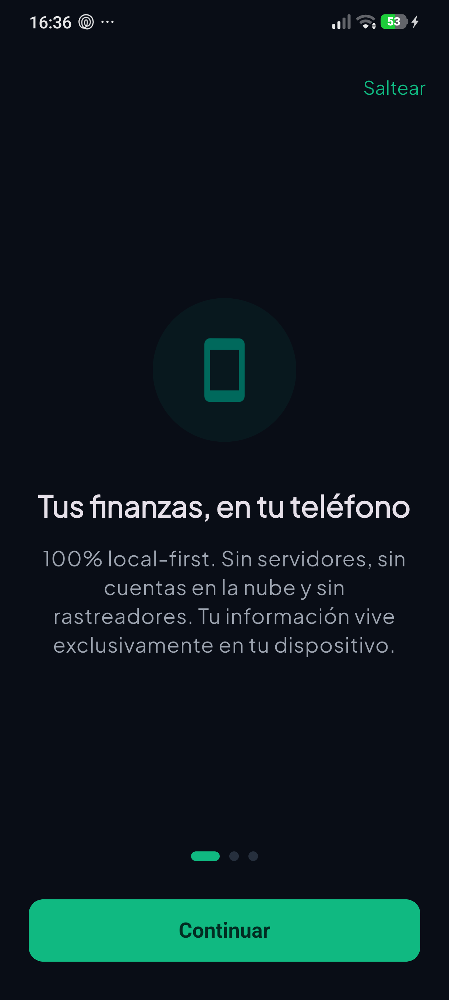

### Bóveda y Seguridad Criptográfica
La base de datos SQLite opera cifrada a nivel de páginas con SQLCipher AES-256. La clave maestra se deriva mediante Argon2id y se almacena en el hardware seguro del teléfono (Android KeyStore) asociada a la huella dactilar.

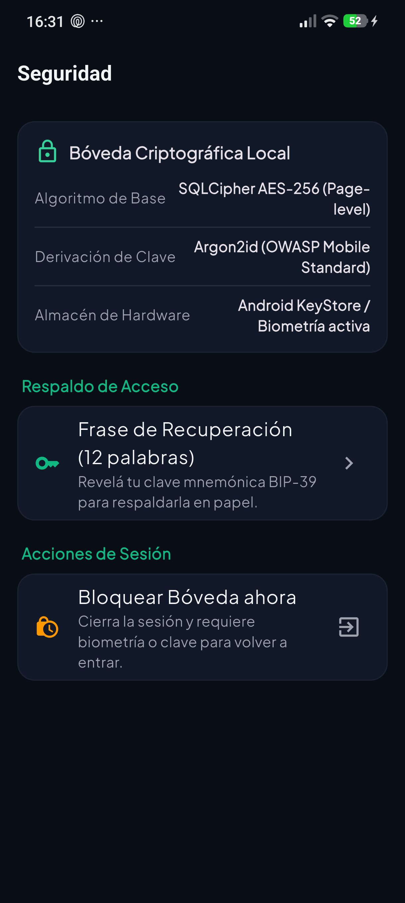

---

## 3. Pestaña 1: Inicio (Dashboard)

El panel principal está diseñado como tablero de un solo vistazo:
- **Balance general**: Saldo total consolidado en la moneda principal elegida (ARS/USD), con desglose rápido de ingresos y egresos.
- **Acceso rápido NLP**: Botón flotante ("+") y barra rápida para registrar gastos escribiendo o dictando por voz.
- **Insights accionables**: Resumen dinámico del comportamiento financiero del período.
- **Accesos directos**: Atajos a las funciones frecuentes (Cuentas, Presupuestos, Metas).
- **Últimos movimientos**: Tarjeta con las transacciones más recientes y acceso directo al listado completo.

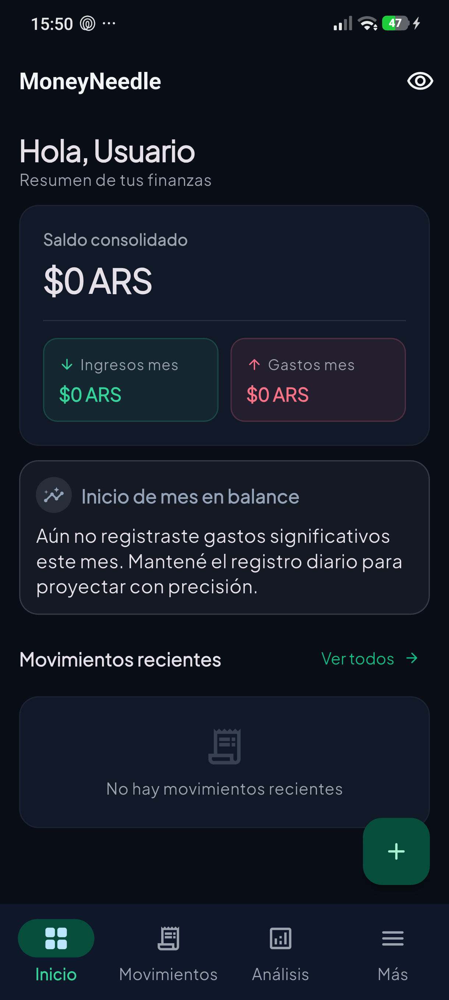

### Registro Rápido con Lenguaje Natural (Needle 3)
Al tocar el botón "+", se abre la hoja de entrada rápida. Permite escribir frases coloquiales argentinas ("almuerzo 4500", "coto 28500", "sube 5000", "sueldo 350k") o activar el reconocimiento por voz para que el modelo IA on-device extraiga monto, categoría y tipo en menos de 50 ms.

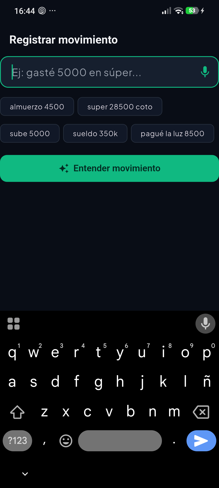

---

## 4. Pestaña 2: Movimientos

Unifica la búsqueda, filtros y listado en una sola vista:
- **Búsqueda instantánea**: Barra de texto superior para buscar por comercio, concepto o categoría con debounce de 300 ms.
- **Filtros por chip**: Botones directos para filtrar por tipo (`Todos`, `Gastos`, `Ingresos`).
- **Paginación infinita**: Carga por demanda en lotes de 30 registros con indicador de fin de lista.
- **Acceso al detalle**: Tocar cualquier ítem abre la pantalla de edición completa.

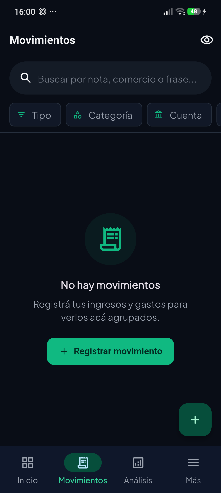

### Detalle y Edición de Movimiento
Pantalla dedicada para ver la metadata completa de un registro: categoría asignada, cuenta de origen, fecha/hora exacta y notas. Incluye botones de acción para editar campos o eliminar (con opción de deshacer).

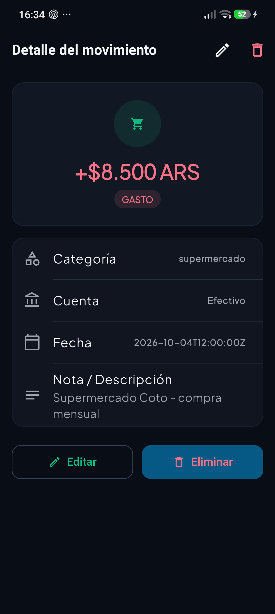

---

## 5. Pestaña 3: Análisis y Métricas

Dedicada exclusivamente a la visualización analítica del dinero:
- **Selector de moneda y período**: Alterná entre ARS y USD, y filtrá por mes actual, mes anterior o último trimestre.
- **Distribución de gastos por categoría**: Gráfico y barras de porcentaje con montos absolutos.
- **Evolución temporal**: Comparativa de gastos e ingresos a lo largo de las semanas del mes.

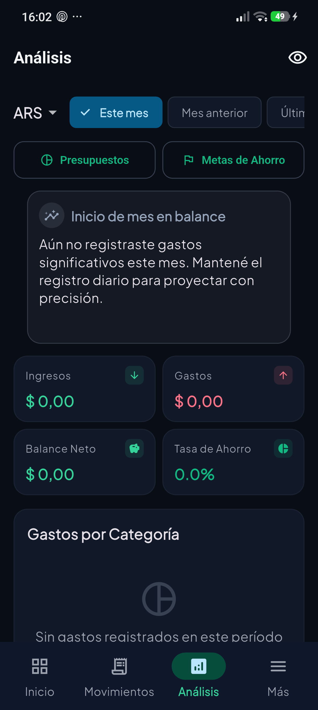

---

## 6. Pestaña 4: Hub "Más"

Centraliza las herramientas avanzadas y configuraciones del sistema en secciones temáticas con tarjetas limpias:

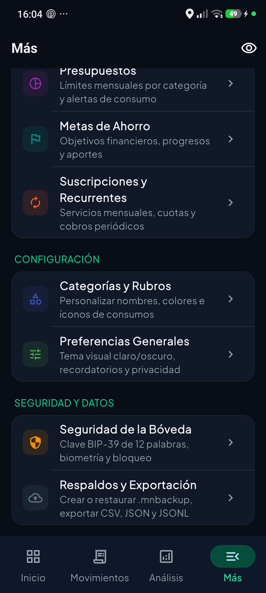

### Gestión Patrimonial: Cuentas y Tarjetas
Permite administrar cuentas bancarias, billeteras virtuales y efectivo. Soporta múltiples monedas, ajuste manual de saldo y registro de transferencias entre cuentas propias.

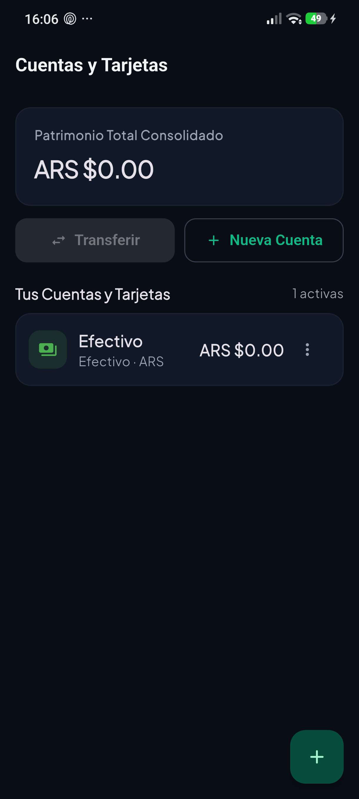

### Planificación: Presupuestos
Fijación de techos máximos de gasto mensual por categoría. Muestra una barra de consumo en tiempo real y el porcentaje consumido respecto al límite.

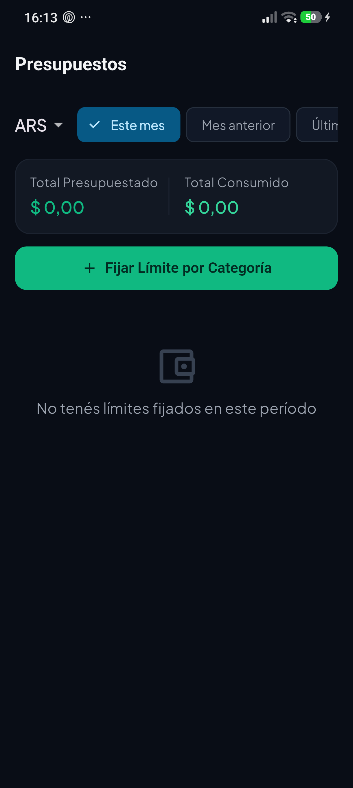

### Planificación: Metas de Ahorro
Creación de objetivos financieros (fondos de emergencia, compras planificadas, viajes) con seguimiento visual de alcancías, aportes acumulados y fecha meta estimada.

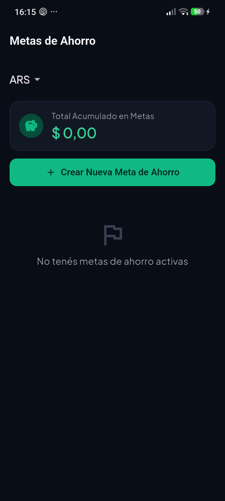

### Planificación: Suscripciones y Recurrentes
Registro de compromisos mensuales o anuales periódicos (alquiler, servicios de streaming, telefonía) con cálculo de compromiso fijo mensual y botón para procesar vencimientos.

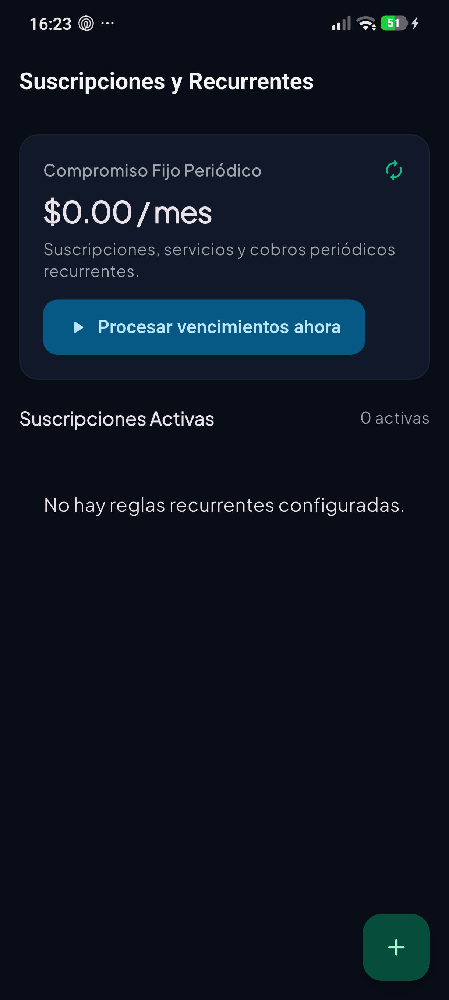

### Personalización: Categorías y Rubros
Configuración de nombres, íconos temáticos y paleta de colores para clasificar gastos e ingresos según las necesidades del usuario.

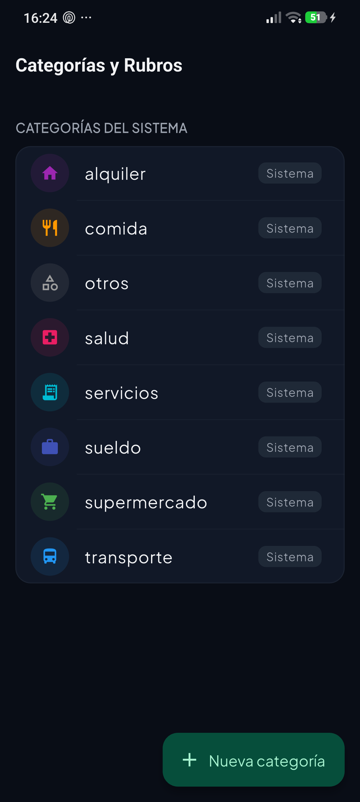

### Sistema: Ajustes y Preferencias
Configuración de tema visual (Claro, Oscuro, Sistema), recordatorio nocturno para registrar compras antes de dormir y modo de privacidad en pantalla (ocultamiento de saldos).

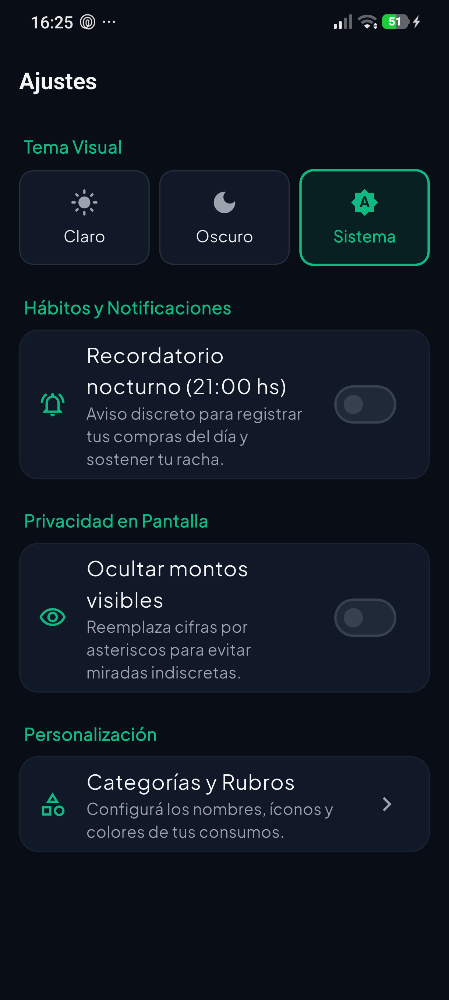

### Sistema: Respaldos y Datos
Exportación de la información en formatos abiertos estándar (CSV, JSON completo, dataset JSONL para reentrenar Tiny Cactus Needle 3) y generación o restauración de copias de seguridad cifradas `.mnbackup`.

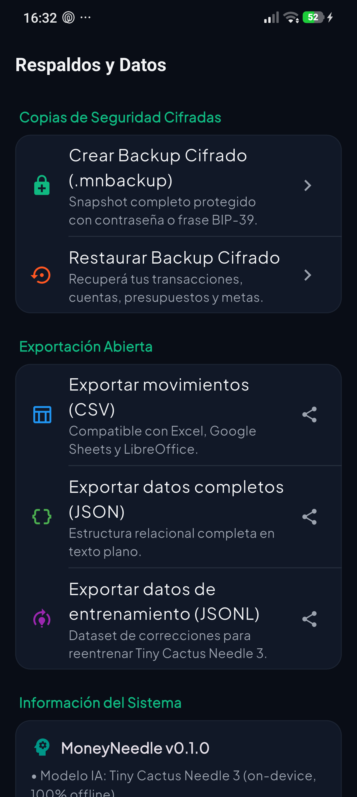
